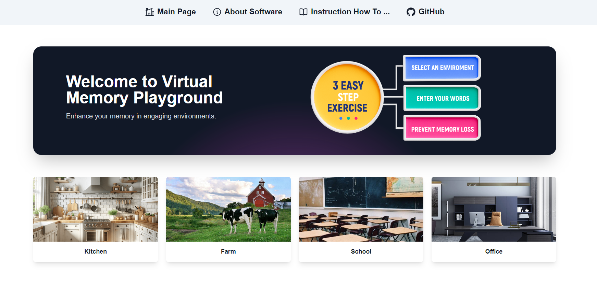
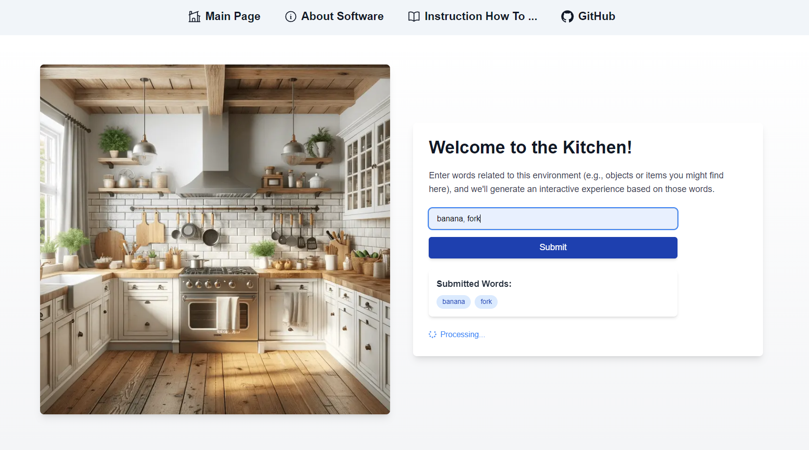
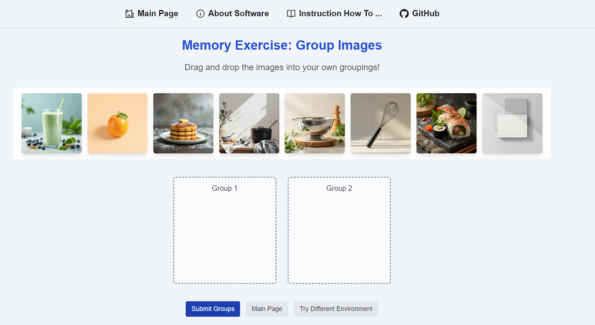
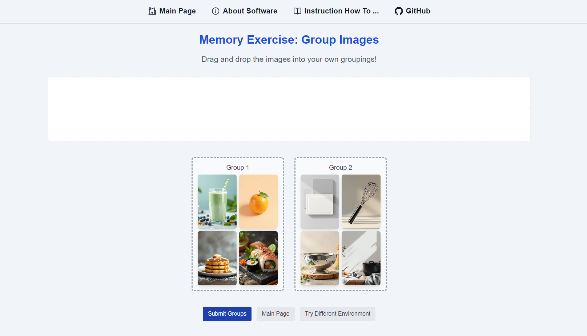

## YouTybe video overview - https://www.youtube.com/watch?v=h4L9kmJkXlg

# Memory Palace: A Digital Tool for Memory Retention

## Inspiration
In 2023, **7.7 million Americans aged 69 and older are living with Alzheimer's disease.** This project was inspired by the urgent need to support individuals facing Alzheimer's and dementia—conditions that progressively impair memory and cognitive function. One of the most effective memory-enhancing techniques is the **Method of Loci**, also known as the **Memory Palace**. This technique involves associating mnemonic images with familiar places to improve memory retention. Our goal is to modernize this approach using cutting-edge AI technologies.

## What It Does
**Memory Palace** is a tool designed to help individuals with memory impairments. It uses **Natural Language Processing (NLP)** to understand user inputs, then clusters and groups the information into categories. Based on these categories, the system generates related images and associations. The user interacts with the platform by grouping the generated images into their correct categories, helping reinforce the memory connection through active engagement.

## How We Built It
We combined several technologies to create the platform:

- **Natural Language Processing (NLP):** Understands user inputs, clusters them into meaningful categories, and assists in generating related images.
- **Image Recognition AI:** Detects and categorizes personal images, grouping them into the user’s life themes.
- **AI-Generated Imagery:** Creates custom images based on the generated categories and associations, providing visual cues that users must then match with the correct categories. This active participation mimics the **Method of Loci**, helping users strengthen memory associations.

## Challenges
A major challenge was ensuring that the NLP accurately understood user inputs and clustered them correctly. Additionally, generating emotionally resonant images that align with each user’s personal memories was complex. Ensuring the user experience was engaging while also being cognitively beneficial was another key consideration.

## Accomplishments
We’re proud of integrating **NLP**, **image generation**, and **categorization** into a system that not only assists with memory recall but actively engages users. The personalized image generation and the interactive memory grouping system have proven to be effective in reinforcing memory connections.

## What We Learned
We learned that combining AI technologies with user-centered design is essential when working on memory-related projects. The interaction between technology and user input needs to feel intuitive and emotionally relevant, especially for users with cognitive impairments.

## What’s Next
We plan to:

- **Expand Image AI Capabilities:** Further enhance the personalization and emotional depth of the generated images.
- **Refine NLP:** Improve the clustering and grouping capabilities to make the system even more context-aware and adaptive to user inputs.

---

Check out the repository for the project [here](https://github.com/OfficialCodeVoyage/HackSMU_Memory_Prevention/tree/main).
